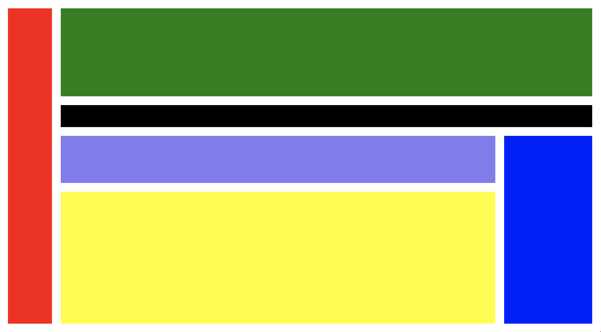

# framer-Dock
Create a dock layer in Framer, and add layers to it based on position and margin.

## Installation

### Automatic installation with [Framer Modules](https://www.framermodules.com/)

<a href='https://open.framermodules.com/dock'>
    
</a>

### Manual installation

Download and move the <code>Dock.coffee</code> file to your modules folder.

Require the module at the top of your file with the following line of code:

```
{Dock} = require "Dock"
```

## Create your Dock

To create your dock simply create a <code>Dock</code> layer like you would any other layer and set its properties.

### Example

```
dock = new Dock
  size: Screen.size
```

## Add a layer to the Dock

dock.addLayer(position, options)

### Arguments

* <code>position</code> - The positioning of the element, "top", "left", "bottom", "right" (optional). Default: "fill"
* <code>options</code> - An object of options for the added layer, to apply any sizing options to the added layer.

### Example

```
dock.addLayer "left",
	color: "red"
	width: 100

dock.addLayer
	color: "pink"
```

* <code>color</code> - The background color of the new layer. Also accepts <code>backgroundColor</code> as an argument.

## Insert an existing layer to the Dock

dock.insertLayer(layer, position)

### Arguments

* <code>layer</code> - The layer you will be inserting into the dock. This layer will stretch to the full width/height of the dock depending on the position.
* <code>position</code> - The positioning of the element, "top", "left", "bottom", "right" (optional). Default: "fill"

### Example

```
layer = new Layer
	height: 50
	backgroundColor: "yellow"

dock.insertLayer layer, "bottom"
```

## Set the margin

dock.margin = {value}

```
dock.margin = 40
```

## Example



```
{Dock} = require "Dock"

yellow = new Layer
	backgroundColor: "yellow"
	height: 300

dock = new Dock
	size: Screen
	margin: 20

dock.addLayer "left",
	color: "red"
	width: 100

dock.addLayer "top",
	color: "green"

dock.addLayer "top",
	color: "black"
	height: 50

dock.addLayer "right",
	backgroundColor: "blue"

dock.insertLayer yellow, "bottom"

dock.addLayer()
```

